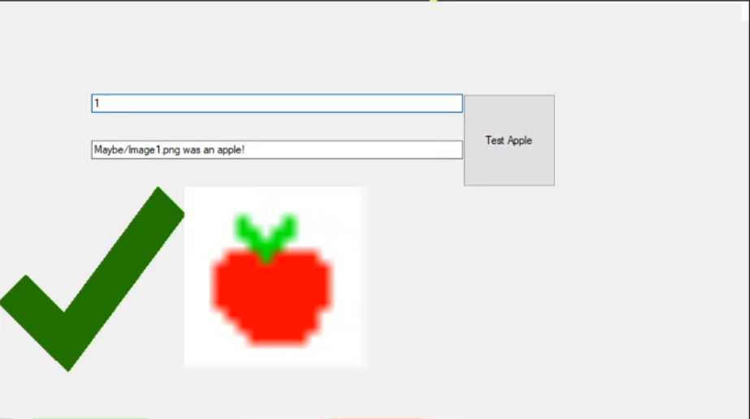

# NeuralNet ->  Simple Apple Identifying Neural Net



## Notes/Know Bugs:

> The program has a very poor U.I at the moment.

> The Apple-identification program has a 5 fail rate at the moment.

> Inputting any number into the top box that isn't a single number that has a corresponding image in the 'Maybe' Folder will crash the program

> Any input that is not a 16 by 16 pixel PNG will crash the program. 

## Features(Planned In Brackets)

GUI that can take modular input to test.

GUI that displays tested-image

GUI that displays NeuralNet's decision of input image.

(GUI that dspalys 'perfect-apple' based on neural net weights. )

A Weight-based neural net program that can be trained on pixel apple images and identify them from random images.

A Modular design to allow other non-iamge inputs

## View of progress

**Adding GUI to Neural Net**


## Latest Build

*14/02/2021 - 0.2a- GUI update *


## Latest Update Notes:
Animated Weapon Alpha

To Sum Up:
Remove Memory Leak bug for good practice 

Add new Enemy Unit type- SoldierGun for fun

Add new Animated Projectile type - target (For when SoldierGun targets player) for variety in combat

Add New Skin- Rambo for a request I got on TikTok

Add New Audio Track - Combat.Wav for player enjoyment

Add Animated player HUD to make game appear more professional 

Add Synced music playing - both background music and sound in-game for better immersion 

Add debug hitboxes for debug purposes

Add UnitType to keep consistent unit generation

Add DebugTimer for better analytics 

Add Corpse Object to allow player to move through bodies 

Add Loading screen for aesthetic 


```

13/02/2021{
	
	NeuralNet.cs -> Modify Name from 'Program.cs' This is  so new program cs file can run the form object
	NeuralNet.cs -> Add static bool 'LastWasApple' to be refrenced if the N.N's decision of an image is needed.

	NeuralNet.cs->Main()-> Modify Method to be callable method 'Run Neural Net'
	NeuralNet.cs->RunNeuralNet()-> Modify Comments to match
	NeuralNet.cs->RunNeuralNet() // NeuralNetForm.cs-> Modify Testing section of the method to be run on button call in NeuralNetForm
	NeuralNet.cs->RunNeuralNet()-> Move 'testLayer' to be a static public var so 'TestImage()' can be run using it.


	NeuralNetForm.cs -> Add a Form object. This is to have a presentation GUI of the NeuralNet at work.
		The intention is it will be able to interate uses of the old console-based 'NeuralNet' program
		by making the 'NeuralNet' program a static class that can be called from a form, using a buton and
		textbox object to provide values and call the test section through a button press
	NeuralNetForm.cs -> OnPaint() -> Add overriding onPaint Method to draw last image searched and a cross or tick
		depending on whether the neural net thought it was an apple. This is for visual feedback of the system working.


}
14/02/2021{
	NeuralNet.cs->RunNeuralNet()-> Add right Count var for each correct guess program makes with test data.
	If more than 1 test data is guessed wrong, reruns program. 


}
```

## Latest Updates

*14/02/2021 - 0.2a- GUI update *


## Next Build

End Of March - 

Cleaner GUI

Simple edge-case handling

More modular user-input / custom input ability


## Skill developing

I planned on this project improving my skills in the following:

> Understanding A.I and Machine Learning in practice.

> Developing custom input/file reading ability

> C# and Visual Studio

> Making programs more modular and better documented. 

> Finding apples.

## Installing and Compiling:

Unzip the 'Images' folder and run the .exe inside.

Type any number between 1-11 and press the button to test whether the Neural Net thinks the given image is an apple.
To use custoem iamges replace any Image file in the 'Maybe' folder with a 16x16 PNG useing only pure white,red or green pixels. 


